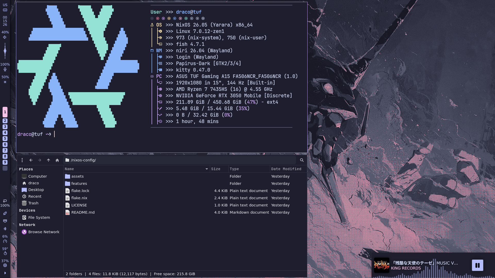

<h1 align="center">❄️ My NixOS Configuration</h1>

<p align="center">
  </br>
  
  
  
  </br>
</p>

## 📚 About



</br>

 - OS: [**`NixOS`**](https://nixos.org/)
 - WM: [**`Niri`**](https://github.com/YaLTeR/niri)
 - Bar: [**`Waybar`**](https://github.com/Alexays/Waybar)
 - Desktop Shell: [**`Noctalia Shell`**](https://noctalia.dev/)
 - Terminal: [**`Kitty`**](https://github.com/kovidgoyal/kitty)
 - Shell: [**`Fish`**](https://github.com/fish-shell/fish-shell)

</br>

<!-- Features -->
## 💫 Features
- **🏡 Home Manager Integration: lots of stuff configured.**
- **🎨 Catppuccin Mocha Theme: A warm blend of rich dark and soft pastels.**
- **🔳 All hotkeys are honed for maximum productivity.**
- **👻 A very lightweight system that consumes less than 600mb of memory.**

<!-- HOTKEYS -->
## 🔥🔑 HotKeys

- **Open the terminal** - `Super + Enter`
- **Open the browser** - `Super + Shift + F`
- **Open the file manager** - `Super + Shift + T`
- **Set a random wallpaper** - `Super + Alt + w`
- **Select wallpaper** - `Super + Ctrl + w`
- **Switch the layout** - `Shift + Alt`
- **Open the application menu** - `Super + R`
- **Take a screenshot** - `Print`
- **Switch to another workspace** - `Super + 1/0`
- **Move the window to another workspace** - `Super + Shift + 1/0`
- **Switch the window to floating mode** - `Super + E`

The other hotkeys are In `features/modules/home-manager/programs/wayland-compositors/niri/default.nix`.

## 💻 Installation
1. **Install NixOS**: If you haven't already installed NixOS, follow the [NixOS Installation Guide](https://nixos.org/manual/nixos/stable/#sec-installation) for detailed instructions.
2. **Clone the Repository:**
```bash
git clone https://github.com/Dracovolodeus/nixos-config.git /nixos-config
cd /nixos-config
```

3. **Copy your hardware-configuration.nix file there:**
```bash
cp /etc/nixos/hardware-configuration.nix /nixos-config/
```

4. **Copy one of the hosts configuration to set up your own:**
```bash
cd /nixos-config/features/hosts
cp -r tuf <your_hostname>
cd <your_hostname>
```

5. **Edit configuration.nix or modules if necessary:**
```bash
nano configuration.nix
```

6. **Copy one of the users configuration to set up your own:**
```bash
cd /nixos-config/features/users
cp -r draco $USER
cd $USER
```

7. **Edit home-manager and wallpapers if necessary:**
* ```bash
  # For home-manager
  cd home-manager
  nano home.nix
  ```

* ```bash
  # For wallpapers
  cd wallpapers
  
  # Add wallpaper
  cp <path_to_wallpaper> ./
  
  # Remove wallpaper
  rm <wallpaper>
  ```
8. **Edit the `flake.nix` file:**
```diff
      hosts = [
--      {
--        # Asus Tuf A15
--        hostName = "tuf";
--        stateVersion = "25.11";
--        system = "x86_64-linux";
--      }
++      {
++        hostName = "<your_host_name>";
++        stateVersion = "<your_state_version>";
++        system = "<your_system>";
++      }
      ];

      users = [
--      {
--        userName = "draco";
--        homeStateVersion = "25.11";
--        system = "x86_64-linux";
--      }
++      {
++        userName = "<your_username>";
++        homeStateVersion = "<your_home_manager_state_version>";
++        system = "<your_system>";
++      }
      ];
```
9. **Rebuilding:**
```bash
  cd /nixos-config
  git add -A
  sudo nixos-rebuild switch --flake ./#<hostname>
  home-manager switch --flake ./#<username>
```

## 📘 Note
The screen resolution I use is 1920x1080, which means if you use a different one some things might be in the wrong position. Feel free to fork this repository and make your own edits!
